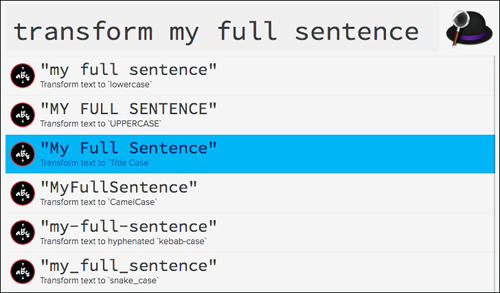

# Change Case — Workflow for Alfred

Changes the case of text selected, provided, or on the clipboard to UPPERCASE, lowercase, Title Case, CamelCase, kebab-case, or snake_case.

[Download the workflow](https://github.com/gillibrand/alfred-change-case/blob/master/Change%20Case.alfredworkflow).

## Usage

Change the case of text on the keyboard with the keyword `case`. All six styles are previewed as Alfred results. Select one to copy it to the clipboard and paste into in the current application.

Optionally, any text typed after `case` will be changed instead of the clipboard.

To assign a global hotkey, view Change Case in Alfred's Workflow editor. Double-click Hotkey node and assign your preferred keys.

## Version History

### 3/23/2022

- Updated to work with macOS Montery (switch to Python 3). Should still work on older systems.
- Simplified icons that are more visible on dark themes.
- Fixed CamelCase to work with all words.
- Removed the default global hotkey. Users can still assign their own in Alfred's workflow editor.

### 9/9/2018

- Updated icons and added additional cases to match original style.
- Added CamelCase, kebab-case, and snake_case to icons.acorn layered file.

### 8/21/2018

- Added CamelCase, kebab-case, and snake_case options.
- Updated icons.
- Added keybinding for text selection transformation.
- Added additional keywords "tt" and "transform" to default workflow options.

### 4/19/2013

- Always sorts the case styles in the same order now: lowercase, uppercase, then title case. (Removed the `uid` from results returned to Alfred as supported in Alfred 2.0.3.).

### 4/6/2013

- Title case will now leave common acronyms as uppercase (HTML, XML, etc.).

## Credits

- Workflow by Jay Gillibrand.
- `titlecase` module by [Stuart Colville](http://muffinresearch.co.uk).
- `CamelCase`, `kebab-case`, and `snake_case` additions added by Ben Wagner.
